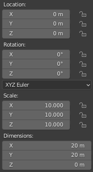
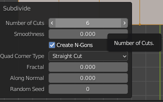
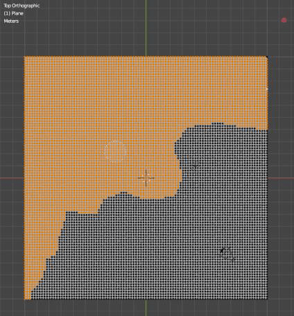
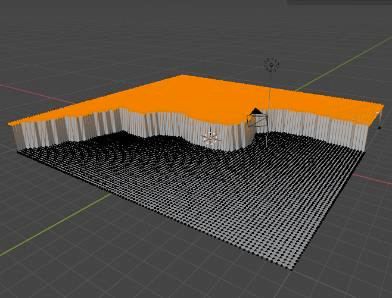
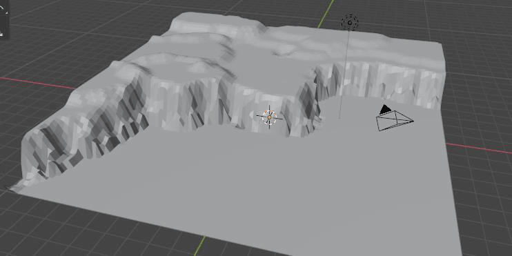
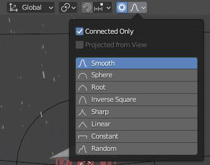
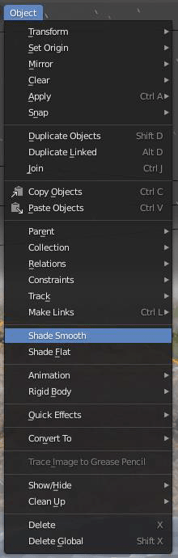
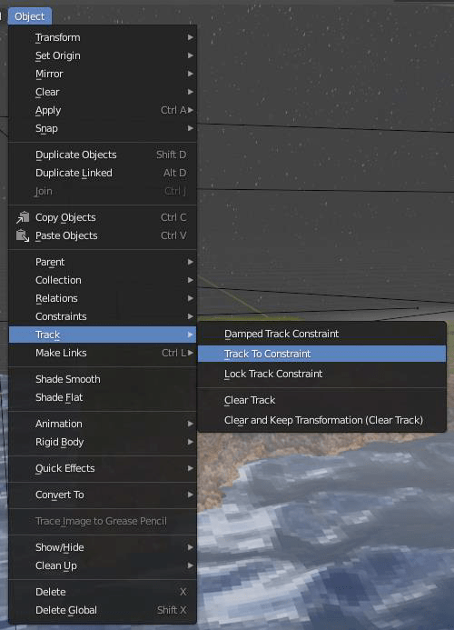

# Escena Faro en Acantilado con Blender

:computer: Proyecto práctico para la asignatura Animación por Ordenador   
:school: Universidad de Huelva  
:books: Curso 2020-2021

---

# Objetivos 
El objetivo del trabajo es generar una escena de Blender formada por un acantilado con un faro en una noche de tormenta con niebla. Para ello habrá que modelar el terreno, el mar y el faro, así como manejar luces y texturas. A continuación, se muestra el resultado final:

---

# Creación del acantilado
Partimos de nuestro archivo “Paisaje Escena”. Creamos una mesh tipo plane, cambiamos la escala x,y,z a 10.000. Estando en modo de edición (tab) y asegurarse de que todos los vértices están seleccionados (tecla “A”). En la plataforma herramientas, haga clic Subdividir varias
veces, hasta quedar algo como se muestra en la imagen.

Teniendo los vértices deseleccionados, usamos la tecla “C” para utilizar la herramienta de selección circular. Seleccionamos aproximadamente la mitad de los vértices en diagonal y hacemos el borde de forma aleatoria simulando el borde de una costa áspera. A continuación, vamos a darle volumen al acantilado, esto se hace desde la vista frontal (teclado numérico “1”), el plano se verá como una línea, pulsamos la tecla “G” para agarrar los vértices seleccionados y moverlos, mantenemos la tecla “Z” para bloquear el movimiento solo verticalmente, lo levantamos aproximadamente dos bloques en la rejilla de guía.

 

Como podemos observar, el resultado no es del todo realista, así que, para retocar los filos, podemos seleccionar vértices en concreto y desplazarlos, pero hacer uso de la opción de la opción proportional editing (tecla “O”), concretamente la opción “Smooth”, hará que los pixeles conexos al que seleccionemos cambien también su posición, pero de una forma más suavizada, así podemos conseguir un efecto más realista. Con esta técnica también podemos crear zonas elevadas de colinas, en la parte superior de lo que tenemos como “meseta”.

  

La escena aún se ve algo angular, para cambiar esto, nos aseguramos de estar en “Object mode” y en el menú Object seleccionamos la opción “Shade Smooth”, esto hará que se vea más suavizado y con un resultado muy satisfactorio.
Ahora vamos a añadir un objeto de tipo empty. Pulsamos “shift A” estando en el modo objeto, en el tipo “Empty” y concretamente crearmos un objeto Plain axes. Teniendo seleccionado el objeto, seleccionamos también la cámara, es importante hacerlo en este orden, para indicar el sentido de la restricción, vamos a la opcion de Objec→Track→Track to Constraint. Colocamos la cámara a
nuestro gusto, jugando con los controles y posiciones de ambos objetos.

 

---