# Escena Faro en Acantilado con Blender

:computer: Proyecto práctico para la asignatura Animación por Ordenador   
:school: Universidad de Huelva  
:books: Curso 2020-2021

---

# Objetivos 
El objetivo del trabajo es generar una escena de Blender formada por un acantilado con un faro en una noche de tormenta con niebla. Para ello habrá que modelar el terreno, el mar y el faro, así como manejar luces y texturas. A continuación, se muestra el resultado final:

---

# Creación del acantilado
Partimos de nuestro archivo “Paisaje Escena”. Creamos una mesh tipo plane, cambiamos la escala x,y,z a 10.000. Estando en modo de edición (tab) y asegurarse de que todos los vértices están seleccionados (tecla “A”). En la plataforma herramientas, haga clic Subdividir varias
veces, hasta quedar algo como se muestra en la imagen.

Teniendo los vértices deseleccionados, usamos la tecla “C” para utilizar la herramienta de selección circular. Seleccionamos aproximadamente la mitad de los vértices en diagonal y hacemos el borde de forma aleatoria simulando el borde de una costa áspera. A continuación, vamos a darle volumen al acantilado, esto se hace desde la vista frontal (teclado numérico “1”), el plano se verá como una línea, pulsamos la tecla “G” para agarrar los vértices seleccionados y moverlos, mantenemos la tecla “Z” para bloquear el movimiento solo verticalmente, lo levantamos aproximadamente dos bloques en la rejilla de guía.

 

Como podemos observar, el resultado no es del todo realista, así que, para retocar los filos, podemos seleccionar vértices en concreto y desplazarlos, pero hacer uso de la opción de la opción proportional editing (tecla “O”), concretamente la opción “Smooth”, hará que los pixeles conexos al que seleccionemos cambien también su posición, pero de una forma más suavizada, así podemos conseguir un efecto más realista. Con esta técnica también podemos crear zonas elevadas de colinas, en la parte superior de lo que tenemos como “meseta”.

  

La escena aún se ve algo angular, para cambiar esto, nos aseguramos de estar en “Object mode” y en el menú Object seleccionamos la opción “Shade Smooth”, esto hará que se vea más suavizado y con un resultado muy satisfactorio.
Ahora vamos a añadir un objeto de tipo empty. Pulsamos “shift A” estando en el modo objeto, en el tipo “Empty” y concretamente crearmos un objeto Plain axes. Teniendo seleccionado el objeto, seleccionamos también la cámara, es importante hacerlo en este orden, para indicar el sentido de la restricción, vamos a la opcion de Objec→Track→Track to Constraint. Colocamos la cámara a
nuestro gusto, jugando con los controles y posiciones de ambos objetos.

 

---

# Creación del Faro

Vamos a empezar a dar forma a un faro, en un fichero aparte, haciendo uso de los comandos de extrusión y escala. Comenzamos creando un mesh circle. Utilizamos el ajuste a 32 vértice, radio de 1. En la vista frontal, con la tecla “G” y el bloque del eje vertical (tecla “Z”), damos una altura aproximada de tres bloques de la rejilla. Seleccionamos los vértices superiores, con la tecla “E”, acercamos hacia el centro los vértices, para hacer que sea más estrecho. Con este método vamos haciendo las diferentes partes. Para ver todo de forma suavizada, repetimos el paso anterior que hicimos en el proceso del acantilado.

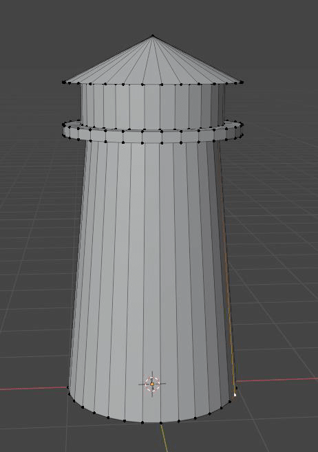 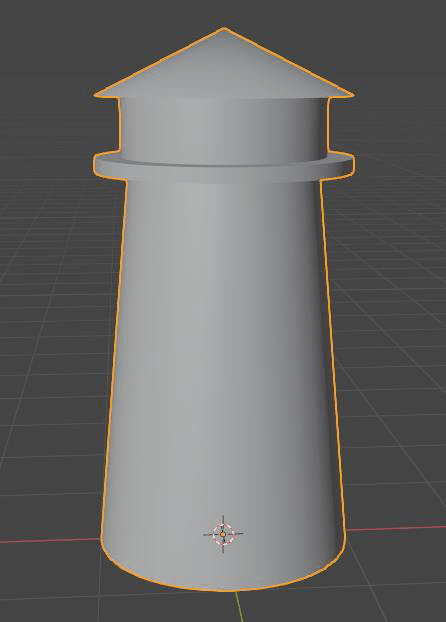

Como observamos, es una estructura sólida y bastante simple, vamos a añadirle una puerta y ventanas. Para ello crearemos Cubos, de forma cuadrada y rectangular y cilindros, los colocamos en la posición que deseemos. Cambiamos al modo “Wireframe” con la tecla “Z”. Seleccionamos el cubo de la lista en Objeto, cambiamos la operación a “diferencia”.

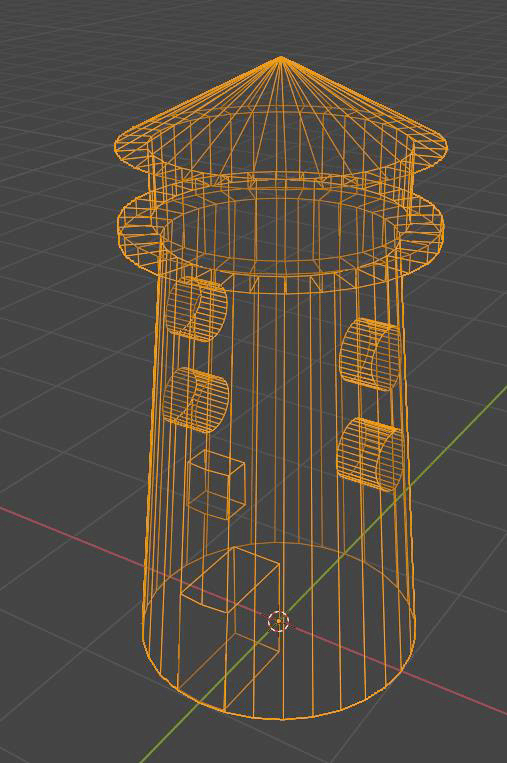

---

# Creación del Océano

Volvemos al fichero “Paisaje escena”. En esta ocasión vamos a crear un plano que no servirá como océano. Añadimos un mesh tipo plane y nos dirigimos a las opciones “Modifier properties”, y cambiamos a modo Ocean, que trae por defecto Blender. Antes de ello, teniendo seleccionados todos los vértices del plano, vamos a Object → Apply → Scale.

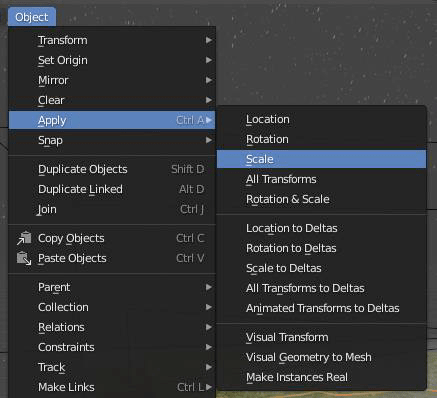 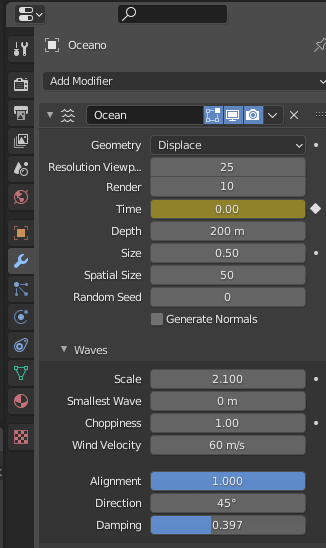

Al principio será sobredimensionado, pero jugando con la
escala y las opciones, podemos ajustarlo a nuestro gusto. Pero
con esto solo tenemos una malla de color plano, tenemos que
añadirle un material para simular el mar. Para que quede más realista, deberemos elevar el plano del oceano para que se encuentre por arriba del suelo del acantilado.

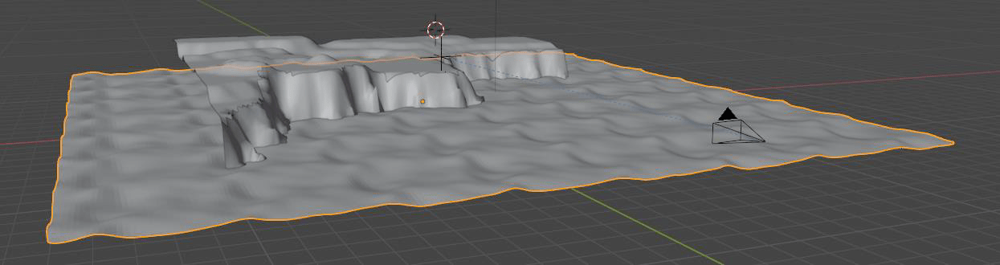

El siguiente paso es añadir un material, con efecto de reflejo de agua, para dar mayor realismo a la imagen. Para ello no s dirigimos a la pestaña de “Shading” y añadimos un nuevo material con los siguientes parámetros. De todos los ajustes, se han modificado el color, bajando su intensidad para crear zonas más oscuras y “Roughness”.

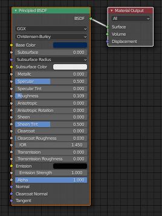 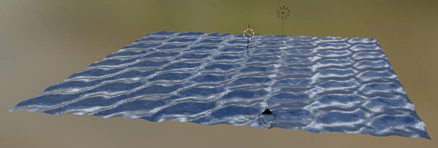

---

# Añadiendo texturas
Para este apartado diferenciaremos entre el acantilado y el faro, aunque siguen procesos muy similares, queremos seguir la organización que se ha llevado hasta ahora, de diferenciar los modelos antes de juntarlos.

## Texturas del acantilado
Si queremos unos resultados básicos, bastaría con ir la herramienta “Material Properties”, añadir un material y un tipo de tratamiento de luz, en este caso sería conveniente de “Difussive BSDF”, seleccionar un color verde para el terreno, imitando la hierba presente en el acantilado, y hacer lo mismo para el agua, pero con tipo de Surface.

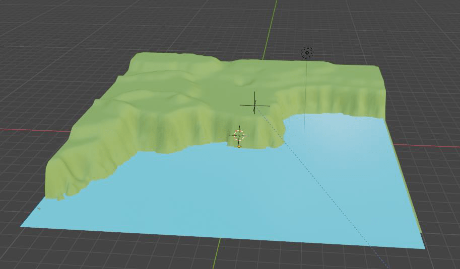

Otra opción que sigue entrando en lo básico, seria seleccionar los vértices pertenecientes a las pareces del acantilado, y separarlos del objeto, y así crear un objeto para las “rocas” y otro para la hierba. Tras separar en dos objetos podremos añadir diferentes materiales y así poner en las rocas un marrón, teniendo un resultado tal que así:

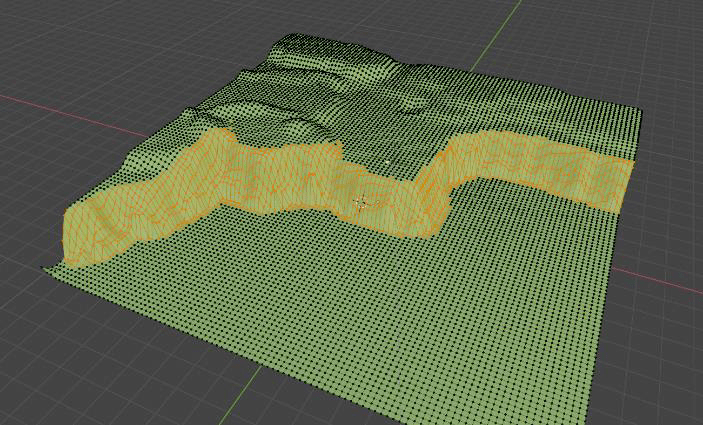 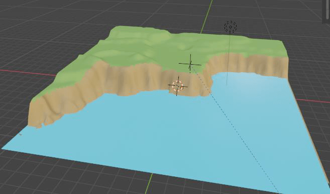

Aunque visualmente, es mucho más agradable, queremos ir un paso más allá y añadir una textura a cada parte. En el tutorial/guía proporcionado en la asignatura, se trata todo con una única textura, pero hemos querido dar un toque diferenciador y seguir otro proceso para añadirlas.

Para las rocas nos interesa que la textura se dibuje de forma vertical. Nos dirigimos a la herramienta “Material Properties”, añadimos un nuevo material con color→Image texture, seleccionamos la imagen deseada en este caso. Cambiamos la visto al modo frontal (tecla numérica “1”) ya que queremos que la textura se dibuje de forma vertical, seleccionamos todos los vértices de las rocas (tecla “A”) , dentro de la herramienta UV mapping (tecla “U”) escogemos la opción Project from View, esto hará que los vértices se proyecten sobre la textura de la misma forma que ahora mismo los estamos observando, pero el resultado es una textura que no tiene la escala que deseamos, para ajustarla nos deberemos ir al menú UV editing.

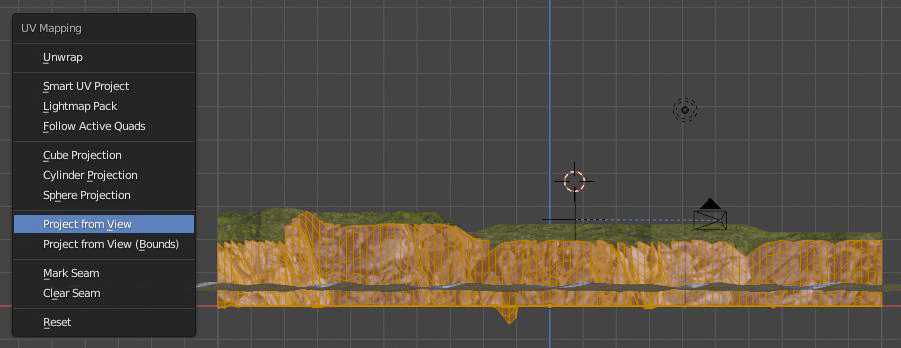

Estando en este menú, nos aseguramos de que, en la
parte superior, está seleccionada la imagen con la que
queremos trabajar, ya que, si anteriormente hemos
añadido otras imágenes, estará la última con la que
hemos trabajado. Una vez asegurado que visualizamos
la imagen que queremos, observamos como sobre la
imagen se pueden ver los vértices, teniéndolos todos
seleccionados podemos moverlos con normalidad
(tecla “G”), podemos rotarlo (tecla “R”) y lo que nos
interesa, podemos reescalarlo (tecla “S”), deberemos agrandar hasta obtener unas texturas de rocas lo más realista posible. Para la hierba repetiremos el mismo procedimiento, pero haciendo uso de la vista superior (desde arriba), ya que la hierba la queremos “pintar” sobre el suelo de forma horizontal. El resultado de texturizar el modelo del acantilado quedaría así:

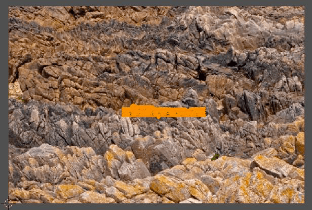 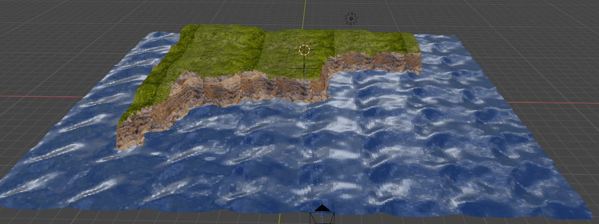

## Textura del faro
Para el faro, repetiremos el mismo proceso. Primero dividiremos en faro en sus diferentes partes, para realizar esto de forma sencilla utilizaremos el modo “WireFrame”. Separaremos entre: cuerpo, pasarela, bombilla (zona donde estará más tarde el foco de luz) y el techo.

Otro paso que hemos realizado ha sido el de en la zona de la bombilla, eliminar grupos de 3 faces, para crear una zona hueca por donde se vean las luces que emite el faro.

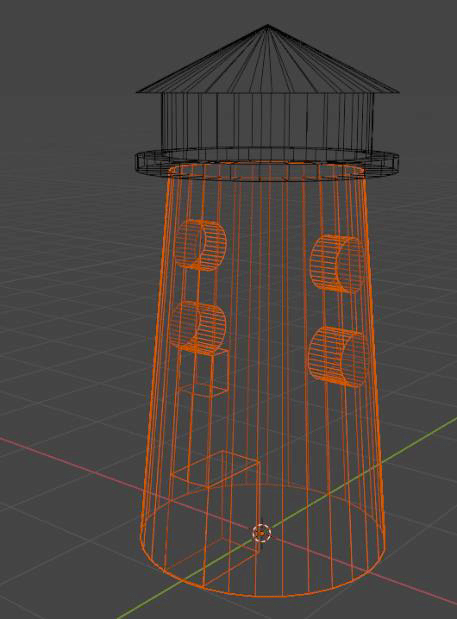

Para la textura del cuerpo del faro, añadiremos como anteriormente un nuevo material con Color→ Image Texture, pero en sus opciones cambiaremos “Flat” por “Tube”. Una vez más cambiaremos a la vista frontal, seleccionamos los vértices del cuerpo, con la herramienta “UV mapping” (tecla “U”) escogemos la opción “Project from View”, nos dirigimos a la pestaña “UV editing” y con la image de la textura de ladrillos, redimensionamos (tecla “S”) todos los vértices, hasta tener una textura de ladrillos realista. Repetimos el proceso con diferentes materiales en el resto del faro.

Para la zona de los “palos” de la zona de la bombilla, se ha escogido por usar un material de Surface→Diffusive BDSF de color rojo, para hacer uso de distintos tipos de materiales. El resultado de todo este proceso es:

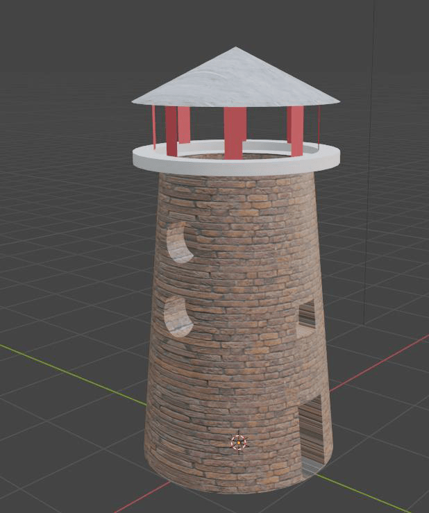

---

# Creación de la niebla
Para la creación de la niebla hemos usado dos técnicas para dar dos efectos distintos. El primero es una niebla general a modo de capa de nubes que cubran toda la costa, para ello hemos usado un cubo de grandes dimensiones que cubra por completo la escena. El segundo ha sido mediante una técnica distinta a la de la guía, crear una capa de niebla en la superficie del agua y la zona baja del faro, ya que la niebla más densa a veces se concentra en esas zonas y así dotamos de mayor realismo.

## Niebla general
Como ya hemos explicado, para la niebla general, partimos de la guía, creando un mesh→ Cube de grandes dimensiones al que le hemos borrado las faces con la opción delete → only faces.
Para dar el efecto de neblina, hemos añadido un material nuevo, con las opciones Surface → None, Volume→Volume Scatter, con un color blanco y Density→0.02, el que sea un valor bajo hace que tenga un efecto de “transparencia”.

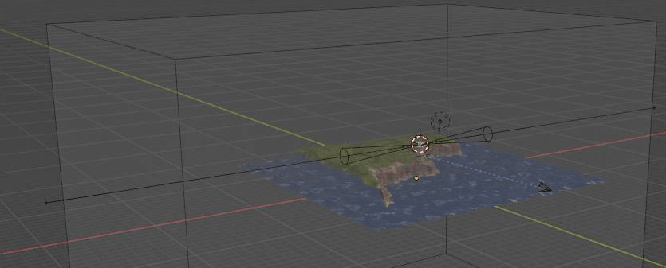 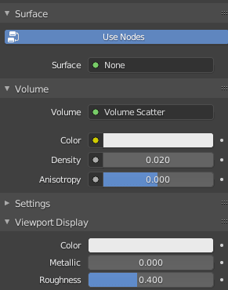

## Niebla del suelo
Para hacer este tipo de niebla más densa hemos querido jugar con otro tipo de técnicas, investigando descubrimos el gran potencial de la pestaña “Shading” por lo que es la pestaña que usamos para el desarrollo de este efecto.

Como el proceso es algo tedioso de explicar, hemos puesto una captura de todas las configuraciones y las explicaremos basándonos en la captura.

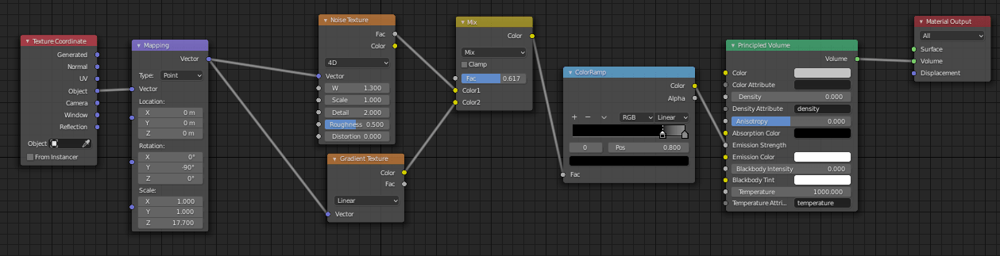

El primer ajuste a tener en cuenta se encuentra en Mapping → Scale. En el cual manejaremos la escala de la niebla, para un mejor ajuste, jugamos entre los valores de escala de shading y los propios del cubo.

El siguiente ajuste sería Noise Texture → Vector → W, es el que nos aportará ese movimiento de la niebla que es movida por el viento de la costa. Más tarde lo modificaremos con keyframes, por ahora solo daremos el valor de la posición inicial. Es importante que en las opciones se encuentre en modo 4D.

Por último, lo más destable es el ColorRamp, jugar con los valores superiores e inferiores, un buen truco es primero ajustar el nivel del negro y cuando más o menos se obtenga una claridad deseada, quitar intensidad al color blanco, para hacer un efecto de mayor transparencia.

El resultado final es bastante logrado y se podría haber usado esta técnica para ambos tipos de niebla, realizando unos ajustes de los parámetros, diferente. Pero hemos querido hacer uso de dos técnicas diferentes con fines didácticos.

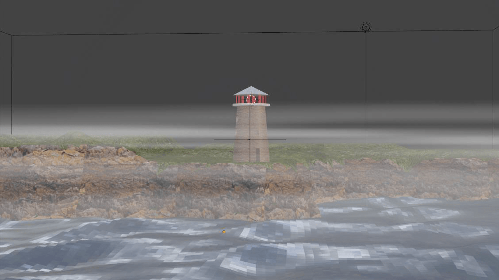

---

# Creación de luces del faro
## Rayos de luz
Tenemos que situar el cursor en la zona interna del faro, para ello nos ayudamos de las diferentes vistas, ocultamos la parte de la bombilla para tener mayor facilidad y que el cursor no sea bloqueado por alguna de las faces. Una vez situado en una posición adecuada, crearemos un spot de luz, shift + A→Light→Spot. No hemos realizado unos ajustes complicados, lo que cabe destacar es la gran diferencia en la potencia entre la guía y nuestro proyecto, donde Power → 80.000W.

Para que sea más real, hemos querido poner un segundo Spot completamente opuesto al actual, para crear como dos rayos de luz en direcciones opuestas. Más adelante los animaremos para que giren.

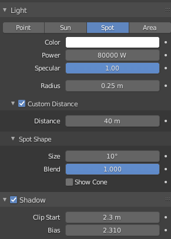

## Halo de luz central
El proceso es similar, solo que esta vez haremos uso de Light → Point. Como la configuración es muy similar solo mostraremos captura de los valores de los ajustes y del resultado final.
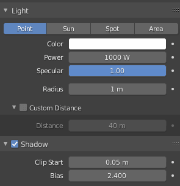 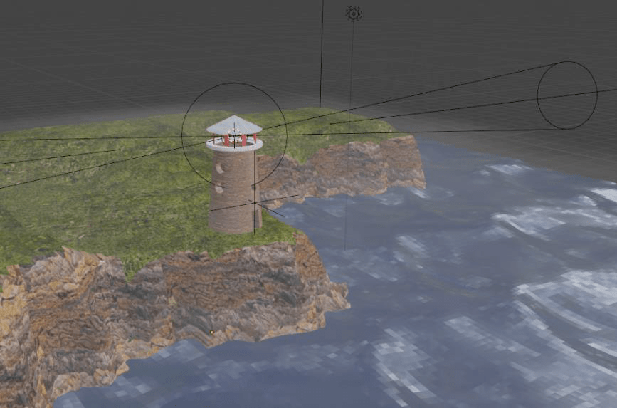

---

# Creación de lluvia
Para la lluvia creamos un mesh → Plane, y lo colocamos en una zona mucho más alta que el modelado de toda la escena. A partir de este plano caerán las gotas de la lluvia, esto se conoce como emisor. Para crear el emisor debemos ir a la herramienta “Particle properties”. En la sección de Render tenemos una opción de Halo, Line, ... Supuestamente con la opción Line ya se deberían de observar las líneas de las gotas de lluvia, pero no cambia, siguen apareciendo la opción de Halo, es decir los copos de nieve. Por tanto, tuvimos que recurrir a la opción de Object y usar un pequeño cilindro a modo de gota de agua. Creamos un mesh → Cylinder, al que le asignamos un material con las mismas características con la que creamos el océano. Una vez realizado esto, procedemos a poner los siguientes ajustes:

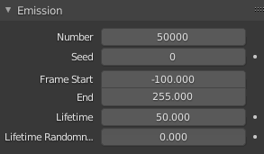 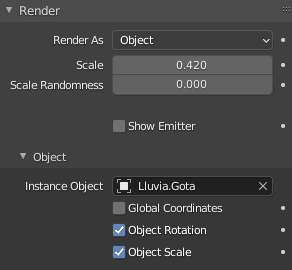 

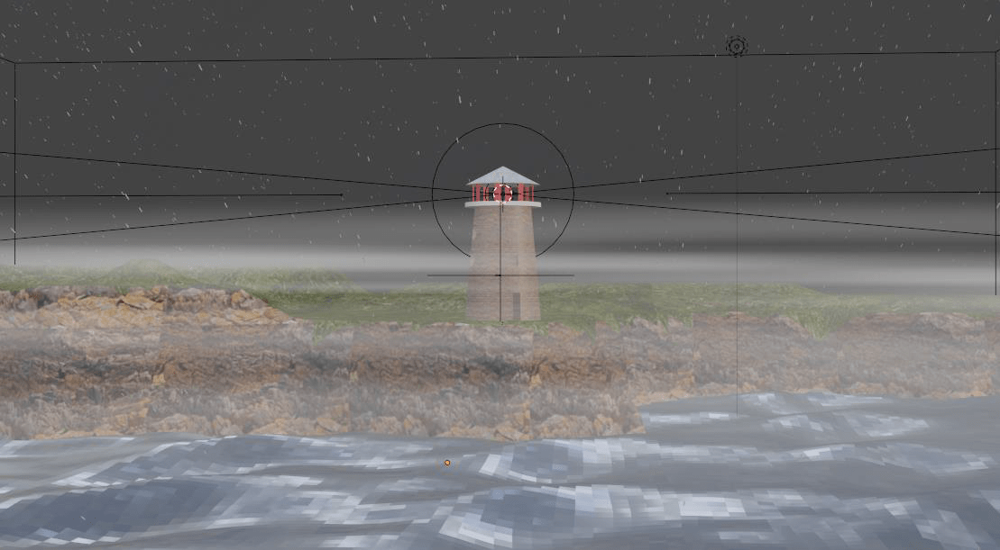

---

# Animación
Para animarlo el proceso ha sido bastante simple. Además de que a nivel personal ya he trabajado con programas como Adobe After Effects donde el uso de keyframes es fundamental, así que adaptarme a la metodología de Blender ha sido tarea muy sencilla.

En resumen, consiste en colocar todos los objetos que queremos en una posición inicial, en la propiedad que vayamos a cambiar, hacemos click derecho en el ratón y seleccionamos la opción de añadir un keyframe, en la barra de tiempo, nos desplazamos al momento que creamos oportuno y modificamos el valor final. Blender se encargará de hacer las interpolaciones. Cabe destacar que hemos seleccionado la opción de interpolación lineal, para que sea constante y no haya acelerones.

Vamos a mostrar capturas de todos los objetos que han sido afectados por animaciones.

## Cámara

## Luces del faro
Es igual para ambos rayos, solo cambian la orientación.
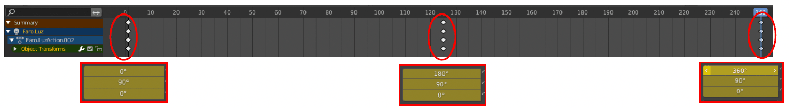

## Océano
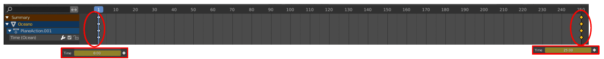

## Niebla del suelo
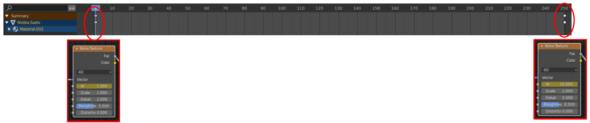

---

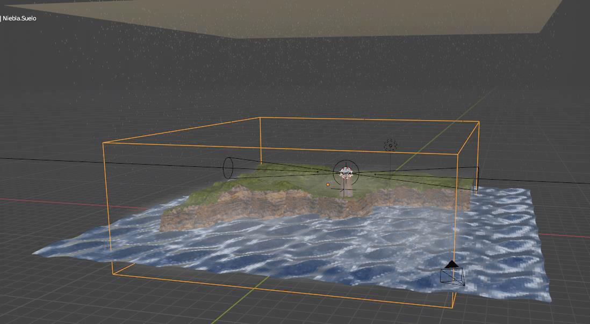

---